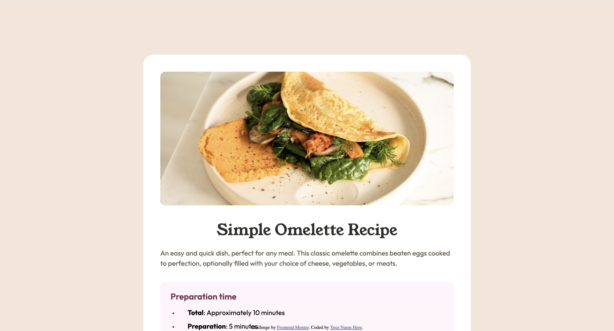

# Frontend Mentor - Recipe page solution

This is a solution to the [Recipe page challenge on Frontend Mentor](https://www.frontendmentor.io/challenges/recipe-page-KiTsR8QQKm). Frontend Mentor challenges help you improve your coding skills by building realistic projects.

## Table of contents

-   [Overview](#overview)
    -   [The challenge](#the-challenge)
    -   [Screenshot](#screenshot)
    -   [Links](#links)
-   [My process](#my-process)
    -   [Built with](#built-with)
    -   [What I learned](#what-i-learned)
    -   [Continued development](#continued-development)
    -   [Useful resources](#useful-resources)
-   [Author](#author)
-   [Acknowledgments](#acknowledgments)

**Note: Delete this note and update the table of contents based on what sections you keep.**

## Overview

### Screenshot



### Links

-   Live Site URL: [Live Site](https://recipe-page-ten-snowy.vercel.app/)

## My process

### Built with

-   Semantic HTML5 markup
-   CSS custom properties
-   Flexbox
-   Mobile-first workflow

### What I learned

I tried to approach this challenge with a mobile first workflow and it ended up working really well. The media
queries at the end of my css file didn't end up extending out that far.

```css
@media screen and (min-width: 48rem) {
    body {
        padding: var(--space-1600) var(--space-600);
        background: var(--stone-100);
    }

    main {
        max-width: 38.5rem;
        border-radius: var(--space-300);
        padding: var(--space-500);
        display: flex;
        flex-direction: column;
        row-gap: var(--space-500);
    }

    img {
        border-radius: var(--space-150);
    }

    .recipe-content {
        padding: 0;
    }
}

@media screen and (min-width: 90rem) {
    main {
        max-width: 48rem;
    }
}
```

Additionally, I learned a little bit about how to style bullet points for list items using the ::marker pseuso-class
selector within css.

```css
.instructions li::marker {
    font: var(--text-preset-5);
    color: var(--brown-800);
}
```

You'll note that I used variables in css to make the styleguide easier to integrate into this project.

### Continued development

I couldn't quite figure out how to align the marker of a list item to the start of it's container in css.
There is also a very minor issue with text not wrapping at the correct points where they do in the design file.

### Useful resources

-   [Styling Markers](https://developer.mozilla.org/en-US/docs/Web/CSS/::marker) - This helped me find the marker
    pseudo selector for list items.

## Author

-   Website - [Josh Kahlbaugh](https://joshuakahlbaugh.pages.dev/)
-   Frontend Mentor - [@Joshk7](https://www.frontendmentor.io/profile/Joshk7)
